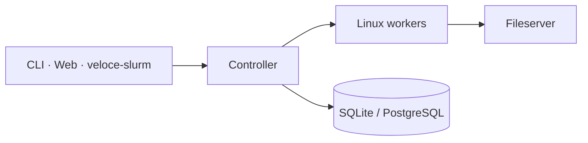

# Veloce

**Version 1.0.0-beta.2** · Rust-native distributed scheduler for HPC, CAE, and AI workloads · [veloce-hpc.io](https://veloce-hpc.io)

Veloce is a Linux control plane you can clone, build, and run. It coordinates compute with Noise-encrypted messaging, cgroup-isolated workers, Apptainer containers, MPI/CWL pipelines, a WASM dashboard, and an optional Slurm-shaped CLI sidecar.

It is **source-available** under the [Business Source License 1.1](LICENSE), not MIT/Apache today. Use it on your own cluster. Do not offer it as a competing hosted or commercially distributed scheduler — see [License](#license).



## Crates

| Crate | Role | Docs |
|-------|------|------|
| [`controller/`](controller/README.md) | Job queue, scheduler, HTTPS API, accounting, HA | [Quickstart](docs/quickstart.md) |
| [`worker/`](worker/README.md) | Job execution, cgroup v2, GRES/GPU, Apptainer, PMI | [Quickstart](docs/quickstart.md) |
| [`common/`](common/README.md) | Wire protocol, scheduling models, shared types | crate README |
| [`cli/`](cli/README.md) | `veloce` management + `veloce-exec` MPI launcher | [CLI JSON](docs/cli-json.md) |
| [`fileserver/`](fileserver/README.md) | HTTPS staging and `.sif` registry | crate README |
| [`web/`](web/README.md) | Leptos WASM dashboard | crate README |
| [`veloce-slurm/`](veloce-slurm/README.md) | `sbatch` / `squeue` / `srun` / `scancel` / `sinfo` facade | crate README |

Sample TOML lives in [`examples/`](examples/). Apptainer registration is in [docs/apptainer.md](docs/apptainer.md). A crate map is in [docs/README.md](docs/README.md).

## Highlights

- **Scheduling** — QoS, preemption, fair share, backfilling, gang scheduling, GRES/GPU, job arrays, CWL DAGs
- **Security** — Noise PSK cluster mesh; REST API keys; job env allowlist
- **Containers** — Apptainer `.sif`, solver manifests
- **Slurm front door** — `veloce-slurm` sidecar; not a Slurm clone

## Why not Slurm

Slurm is a proven batch manager: partitions, slurmd, accounting daemons, and a huge `#SBATCH` dialect. Veloce is a smaller control plane with a different shape.

- **API-first** — jobs, nodes, logs, and metrics go through HTTPS and the `veloce` CLI. The WASM dashboard is the same API, not a CGI layer on top of `scontrol`.
- **One mesh** — controller, workers, and CLI share a Noise PSK (`VELOCE_SECRET`). There is no slurmd/slurmctld split and no Munge realm to stand up beside it.
- **Isolation on the worker** — cgroup v2, optional Apptainer `.sif` jobs, and a built-in PMI path for MPI. Containers and ranks are scheduler features, not a site overlay.
- **Workflows in-tree** — CWL DAGs, job arrays, QoS, and GRES/GPU pinning live in the controller, not in SPANK plugins.
- **Slurm muscle memory, not slurmd** — [`veloce-slurm`](veloce-slurm/README.md) maps `sbatch` / `squeue` / `srun` / `scancel` / `sinfo` onto `veloce --json`. It skips partition folklore and does not speak the Slurm wire protocol. Brownfield scripts can land; the source of truth stays Veloce.

If you need a SchedMD cluster, use Slurm. If you want a Rust scheduler you can build from this tree and drive over REST and a dashboard, start with the [quickstart](docs/quickstart.md).

## Quick start

A single-node lab (self-signed TLS, file accounting) is documented end-to-end in **[docs/quickstart.md](docs/quickstart.md)**. Short version:

```bash
cargo build --locked --release \
  -p veloce-common -p veloce-controller -p veloce-worker \
  -p veloce-cli -p veloce-fileserver -p veloce-slurm

# optional dashboard
cd web && trunk build --release && cd ..

export VELOCE_SECRET="$(openssl rand -base64 32)"
export VELOCE_API_KEY="$(openssl rand -base64 32)"
export VELOCE_FILESERVER_KEY="$(openssl rand -base64 32)"

# copy examples/*.toml, fill secrets, generate cert.pem/key.pem, then:
veloce-fileserver
veloce-controller
veloce-worker
veloce doctor
veloce submit --name baseline-run --nodes 1 --cores 1 --mem 512 /bin/sleep 5
```

`veloce-slurm` expects a `veloce` binary on `PATH` (or `VELOCE_BIN`).

## License

Business Source License 1.1 — see [LICENSE](LICENSE).

- Copy, modify, and run for non-production use.
- Production use is allowed for **your own** cluster (Additional Use Grant).
- You may **not** use this work as a competing hosted or commercially redistributed HPC/SimOps control plane.
- On **2030-09-15**, or four years after the first public distribution of a given version (whichever is first), that version converts to **Apache License 2.0**.

“Veloce” is a trademark of the Licensor. This license does not grant trademark rights.
