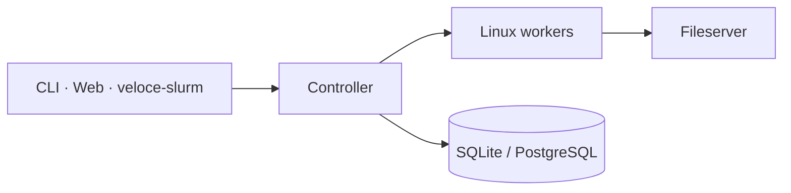

# Veloce Community Edition

**Version 1.0.0-beta.2** · Rust-native distributed scheduler for HPC, CAE, and AI workloads.

This tree is the **Community Edition (CE)** of Veloce: a Linux control plane you can clone, build, and run. It coordinates compute with Noise-encrypted messaging, cgroup-isolated workers, Apptainer containers, MPI/CWL pipelines, a WASM dashboard, and an optional Slurm-shaped CLI sidecar.

It is **source-available** under the [Business Source License 1.1](LICENSE), not MIT/Apache today. Use it on your own cluster. Do not offer it as a competing hosted or commercially distributed scheduler — see [License](#license).



## What this edition includes

| Crate | Role |
|-------|------|
| `controller/` | Job queue, scheduler, HTTPS API, accounting |
| `worker/` | Job execution, cgroup v2, GRES/GPU, Apptainer, PMI |
| `common/` | Wire protocol, scheduling models, shared types |
| `cli/` | `veloce` management + `veloce-exec` MPI launcher |
| `fileserver/` | HTTPS staging |
| `web/` | Leptos WASM dashboard |
| `veloce-slurm/` | `sbatch` / `squeue` / `srun` / `scancel` / `sinfo` facade over `veloce` |

Not in this repository (full Veloce product): MCP server, federation gateway, KEDA scaler, Windows workers, commercial solver FlexLM maps.

Crate READMEs next to the source (`controller/README.md`, `worker/README.md`, `cli/README.md`, …) have flags and build notes.

## Highlights

- **Scheduling** — QoS, preemption, fair share, backfilling, gang scheduling, GRES/GPU, job arrays, CWL DAGs
- **Security** — Noise PSK cluster mesh; API keys; job env allowlist
- **Containers** — Apptainer `.sif`, solver manifests
- **Slurm front door** — `veloce-slurm` sidecar; not a Slurm clone

## Quick start

Build the native binaries (not `veloce-web` — that is WASM):

```bash
cargo build --locked --release \
  -p veloce-common -p veloce-controller -p veloce-worker \
  -p veloce-cli -p veloce-fileserver -p veloce-slurm
```

Dashboard:

```bash
cd web && trunk build --release
```

Point `VELOCE_SECRET` (and the usual controller/worker env) at a lab pair, then:

```bash
veloce submit --name baseline-run --nodes 1 --cores 1 --mem 512 /bin/sleep 5
veloce jobs list --mine
veloce jobs logs <JOB_ID> --follow
```

`veloce-slurm` expects a `veloce` binary on `PATH` (or `VELOCE_BIN`).

This snapshot does not yet ship the private tree’s Docker HA / lightweight compose scripts. Wire processes from the crate READMEs until a CE lab stack lands.

## License

Business Source License 1.1 — see [LICENSE](LICENSE).

- Copy, modify, and run for non-production use.
- Production use is allowed for **your own** cluster (Additional Use Grant).
- You may **not** use this work as a competing hosted or commercially redistributed HPC/SimOps control plane.
- On **2030-09-15**, or four years after the first public distribution of a given version (whichever is first), that version converts to **Apache License 2.0**.

“Veloce” is a trademark of the Licensor. This license does not grant trademark rights.

## Status

Community Edition source: federation API/UI, MCP/agent, and FlexLM manager routes are stripped. Wire `Message` variants and `wait_for_licenses` / solver `LicensingConfig` fields remain for protocol compatibility. CWL, Apptainer, PMI, and HA stay in this tree.
