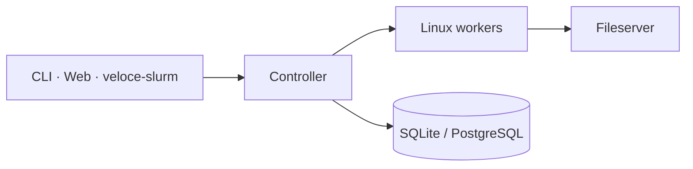

# Veloce

[](https://github.com/mihaselow/veloce-ce/actions/workflows/ci.yml)
[](LICENSE)
[](https://www.rust-lang.org/)
[](https://veloce-hpc.io)

**A Rust-native control plane for HPC, CAE, and AI jobs.** Clone it. Build it. Run a cluster without slurmd, Munge, or a CGI layer on `scontrol`.

Veloce is one Noise-encrypted mesh: controller, Linux workers, HTTPS API, WASM dashboard, Apptainer `.sif` jobs, MPI via PMI, CWL DAGs, and an optional `sbatch`-shaped sidecar. Source-available under [BSL 1.1](LICENSE) — your cluster, not a competing hosted scheduler.



## Why people look here

| You want | Veloce does |
|----------|-------------|
| Submit over HTTPS | `veloce submit`, REST, WASM dashboard — same API |
| Isolate jobs | cgroup v2 on the worker, optional Apptainer `.sif` |
| Run MPI without a site overlay | PMI-1/2 in-tree; `veloce-exec` as the OpenMPI remote agent |
| Keep `#SBATCH` muscle memory | [`veloce-slurm`](veloce-slurm/README.md) maps `sbatch` / `squeue` / `srun` / `scancel` / `sinfo` — it is **not** slurmd |
| Ship a workflow | CWL DAGs, job arrays, QoS, GRES/GPU pinning in the controller |

**Not in this tree:** a Slurm clone, Windows workers, or a hosted SaaS. If you need SchedMD, use Slurm. If you want a scheduler you can `cargo build` and drive from a laptop lab, stay.

## Quick start

**Rust 1.94+**, Linux, OpenSSL. [Apptainer](https://apptainer.org/) is **optional**: install it on every **worker** that should run `--image` / `.sif` jobs (`apptainer` on `PATH`). The controller and fileserver only store images; they do not execute them. Full walkthrough: **[docs/quickstart.md](docs/quickstart.md)**.

```bash
cargo build --locked --release \
  -p veloce-common -p veloce-controller -p veloce-worker \
  -p veloce-cli -p veloce-fileserver -p veloce-slurm

export VELOCE_SECRET="$(openssl rand -base64 32)"
export VELOCE_API_KEY="$(openssl rand -base64 32)"
export VELOCE_FILESERVER_KEY="$(openssl rand -base64 32)"

# copy examples/*.toml, fill secrets, mint cert.pem/key.pem, then:
veloce-fileserver && veloce-controller && veloce-worker
veloce doctor
veloce submit --name baseline-run --nodes 1 --cores 1 --mem 512 /bin/sleep 5
```

Dashboard: `cd web && trunk build --release`. Container jobs: [docs/apptainer.md](docs/apptainer.md) (Apptainer on the worker). Prebuilt **amd64** `.deb` / `.rpm` / `.tar.gz` (including `veloce` + `veloce-exec`) ship on [GitHub Releases](https://github.com/mihaselow/veloce-ce/releases) — see [packaging/README.md](packaging/README.md).

## Documentation

| Guide | What you get |
|-------|----------------|
| [Quickstart](docs/quickstart.md) | Lab TLS, sample TOML, three daemons, first job |
| [Packaging](packaging/README.md) | Role packages, systemd templates, release workflow |
| [Apptainer](docs/apptainer.md) | `.sif` registry, solver manifests, `veloce containers`, GPU |
| [CWL](docs/cwl.md) | DAG submit from YAML (`veloce submit --cwl`) |
| [MPI / PMI](docs/mpi.md) | In-tree PMI, `veloce-exec`, OpenMPI `plm_rsh_agent` |
| [CLI JSON](docs/cli-json.md) | `veloce --json` contract for scripts and `veloce-slurm` |
| [HTTPS API](docs/rest.md) | Controller routes in this tree |
| [veloce-slurm](veloce-slurm/README.md) | Honor / skip / reject map for `#SBATCH` |
| [Examples](examples/) | `veloce.toml`, worker/fileserver/web/CLI samples, `hello_sleep.sh` |

Crate internals: [controller](controller/README.md) · [worker](worker/README.md) · [cli](cli/README.md) · [fileserver](fileserver/README.md) · [web](web/README.md) · [common](common/README.md). Index: [docs/README.md](docs/README.md).

## Crates

| Crate | Role |
|-------|------|
| [`controller/`](controller/README.md) | Queue, scheduler, HTTPS API, accounting, HA |
| [`worker/`](worker/README.md) | Exec, cgroup v2, GRES/GPU, Apptainer, PMI, TTY/VNC |
| [`common/`](common/README.md) | Noise `Message` protocol, scheduling types |
| [`cli/`](cli/README.md) | `veloce` + `veloce-exec` |
| [`fileserver/`](fileserver/README.md) | HTTPS staging + `.sif` store |
| [`web/`](web/README.md) | Leptos WASM dashboard |
| [`veloce-slurm/`](veloce-slurm/README.md) | Slurm-shaped CLI facade |

## Why not Slurm

Slurm is a proven batch manager: partitions, slurmd, accounting daemons, a huge `#SBATCH` dialect. Veloce is smaller and shaped differently.

- **API-first** — jobs, nodes, logs, and metrics go through HTTPS and the `veloce` CLI. The WASM dashboard is the same API.
- **One mesh** — controller, workers, and CLI share a Noise PSK (`VELOCE_SECRET`). No slurmd/slurmctld split, no Munge realm beside it.
- **Isolation on the worker** — cgroup v2, optional Apptainer, PMI for MPI. Not a site overlay.
- **Workflows in-tree** — CWL, arrays, QoS, GRES/GPU live in the controller.
- **Slurm mouth, Veloce brain** — `veloce-slurm` maps familiar commands onto `veloce --json`. It does not speak the Slurm wire protocol.

## Status

**1.0.0-beta.2** — lab-buildable Community Edition. CI runs fmt, clippy, tests, locked build, and a WASM check. Report vulnerabilities via [SECURITY.md](SECURITY.md).

## License

[Business Source License 1.1](LICENSE).

- Copy, modify, and run for non-production use.
- Production use is allowed for **your own** cluster (Additional Use Grant).
- You may **not** offer this as a competing hosted or commercially redistributed HPC/SimOps control plane.
- On **2030-09-15** (or four years after first public distribution of a given version), that version converts to **Apache License 2.0**.

Licensing and security fallback: [hello@veloce-hpc.io](mailto:hello@veloce-hpc.io). “Veloce” is a trademark of the Licensor.
